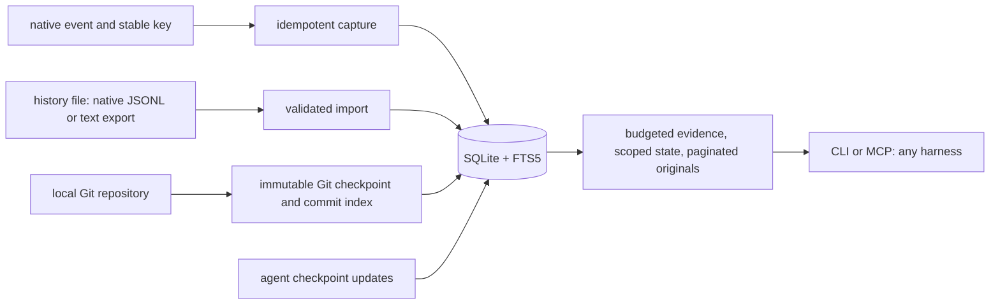

# SQnic architecture

## purpose and boundary

SQnic carries available conversation, tool, and Git context between coding harnesses.
It is a local Rust executable with an embedded SQLite database and no network client or model dependency.
The CLI is the universal interface; an MCP stdio server calls the same application operations.
Harness instructions teach selective retrieval and incremental updates.
SQnic does not recreate hidden reasoning, live processes, unavailable attachments, or proprietary session state.

## data flow

## storage and identity

- A task has an explicit user-selected ID and a canonical worktree path.
- A source belongs to exactly one task and has a canonical path, format, consumed byte offset, and prefix digest.
- Events are immutable source records with normalized searchable text, exact raw text, and source line provenance.
- Current notes are keyed by task, explicit scope, kind, and key; each update creates an immutable revision.
- Commits are identified by task and full object ID; metadata and deterministic change summaries are indexed once.
- Human or agent explanations are separate from Git evidence and carry an author label.

SQLite uses foreign keys, WAL, a busy timeout, transactions, and a schema version.
New private data directories and files use restrictive permissions on Unix.
The default data location is outside the repository, with an explicit `--db` override for portable stores and tests.
There is no automatic scan of a user's home, no mutation of source histories, and no automatic configuration edits.

## import and recovery contract

Native readers cover Claude Code, Codex rollout/exec JSONL, and Pi JSONL.
Generic JSONL accepts arbitrary objects and retains unknown fields; text imports support Markdown and Cursor text exports.
All available records are retained, including unknown event types and tool arguments/results.
Binary attachment contents are not fetched.
Complete JSONL lines are imported transactionally; an unfinished last line remains pending until completed.
Malformed complete records fail with a line number and roll back that file's import.
Repeated imports do not duplicate events.
On refresh, the consumed prefix is streamed through a digest to detect edits or truncation before appending new records.
This avoids reparsing old records but still reads old bytes; benchmark this cost explicitly.
A rewritten source is rejected rather than silently mixed with its old version; import the changed export from a new path.
Text exports are immutable snapshots because their structure has no stable append boundary.

## retrieval contract

`resume` reads current notes plus short recent event and commit excerpts.
It reports source coverage, omitted material, and references for further retrieval.
Output has an explicit character budget; token counts are estimates, never tokenizer-independent guarantees.
`search` uses FTS5 with quoted literal terms, scoped to one task.
`history`, `read`, `commits`, and `commit` expose paginated source detail.
Read operations do not import history, run Git, or call a model.
Retrieved history is evidence, not permission or a replacement for the destination's current instructions.

## writes and commit summaries

`update` accepts a single changed note, validates its kind, and supports optimistic revision checking.
`sync` refreshes registered files and indexes missing commits from HEAD ancestry, reporting partial completion if a later source fails.
Each file and Git batch is an atomic, restartable unit.
`git-sync` records the indexed HEAD, branch, and dirty status without claiming current state on later reads.
Commit summaries contain the author's message, parent IDs, and file statistics; they are explicitly deterministic summaries.
An agent can attach a semantic explanation after reading the commit detail.
Tests are only described as passing when recorded evidence says so.
Diffs are retrieved from the local Git repository on explicit request; Git remains their source of truth.

## modules and implementation order

1. `model`, `store`: schema, typed operations, task and note identity, bounded reads.
2. `import`: native normalization, source provenance, restartable incremental import.
3. `git`: commit index, snapshot, on-demand diff, semantic annotations.
4. `normalize`, `capture`, `evidence`: native relationships, direct writes, scoped and historical bundles.
5. `main`, `mcp`: CLI and stdio tool interface over shared operations.
6. `skills/sqnic`: concise instructions and integration examples.
7. tests and benchmark scripts: disposable fixtures, release measurements, real harness checks.

## verification and completion gates

Test preservation of user constraints, tool outputs, branch metadata, unknown records, and commit details across imports.
Test idempotency, rewritten inputs, partial lines, malformed input rollback, task isolation, note conflicts, empty histories, Unicode budgets, and concurrent writes.
Exercise the CLI and MCP through real process I/O, including protocol errors.
Run formatting, tests, Clippy with warnings denied, and release builds.
Measure each public query with repeated samples, reporting p50/p95/p99, process startup, import throughput, storage size, and output size.
Use synthetic workloads with stated sizes and separately report actual Claude Code and Codex tests.
The harness test must recover facts and commit evidence using SQnic, not direct access to the original transcript.
Obtain an independent read-only review before completion.

## schema 3: source-preserving retrieval

`normalize` extracts native identity and tool references in the import transaction.
Unresolved references are resolved at read time within source/session identity, so later appended targets become available without rewriting old events.
Unknown fields remain in exact raw records.
Episode IDs identify a grouping heuristic; they are not proof of causal order or a reconstructed active branch.
Unique parent and tool links, rather than sibling episode expansion, supply bundle context.

`evidence` reads a SQLite snapshot, applies an explicit scope and optional checkpoint watermark, and packs atomic notes and original evidence into a serialized-byte budget.
Git checkpoints preserve observed HEAD/status, an event watermark and the reachable commit set.
No automatic causal relationship between a test and commit is inferred.
Explicit attributed links supply that relationship for inspection.

`capture` is an idempotent append interface for adapters that already receive individual events.
It avoids rereading an external log without weakening the separate file-import contract.
`enrich` stores immutable attributed search representations; originals and note state do not change.

Schema upgrades run atomically under an immediate transaction.
The v2-to-v3 upgrade builds normalized metadata, maps note revisions to their source events, and rebuilds FTS with a task field.
This is a one-time full scan and index build, not a constant-time startup operation.
Future-version databases are rejected.

Scoped FTS matching is used only when the task accounts for less than one quarter of recorded events; larger tasks use the body index and exact SQL task filter.
The threshold is a performance heuristic, not a correctness boundary.
Every search keeps exact SQL task filtering, including task IDs with punctuation or no alphanumeric characters.

## MCP profiles

The default `full` profile retains all 22 operations.
The optional `handoff` profile exposes seven operations: restore, evidence, read_many, search, commit, notes and update.
Discovery and dispatch apply the same filter, so a hidden operation is rejected before execution.
The CLI retains the full interface.

## existing-project sync and scale

`sync TASK --repo PATH --history FILE` composes task registration, history refresh and Git indexing through the same CLI/MCP application path.
Registration verifies the canonical worktree binding before importing anything.
Supplied history paths are canonicalized and merged with registered sources; each unique path is processed once.
No new schema, daemon or dependency is needed.
Each file and Git batch retains its own transaction; earlier completed work survives a later failure, and retrying resumes safely.
A failed onboarding call can leave task registration saved.

Retrieval returns bounded evidence rather than the whole project history.
This bounds returned context, not all search work or ingestion cost.
Strict file refresh still reads the consumed prefix, and Git sync still walks HEAD ancestry and stores the reachable commit set for every checkpoint.
Initial Git indexing runs a metadata command for each missing commit.
Those costs need further profiling and checkpoint storage improvements before claiming efficient operation on very large commit histories.
The existing 100,000-record benchmark does not establish million-record or million-commit performance.

The proposed lesson workflow is separate and remains unimplemented.
For that workflow, candidate lessons should be scoped to their project/component, analyzed incrementally, and deduplicated by independent session evidence.
Only a small, reviewed set of broadly applicable rules should enter always-loaded instructions.

## automatic capture and restore

See [the automatic handoff plan](automatic-handoff-plan.md) for schema-v4 lifecycle states, adapter contracts, recording limits and privacy behavior.
The existing source importer remains responsible for atomic raw storage and prefix verification.
Automatic entry points add session identity validation on the same open file descriptor and a transaction-time enabled/session guard.
A separate OS file lock serializes reconciliation across foreground, one-shot and background callers.
Git indexing also checks automatic recording eligibility inside its write transaction.
