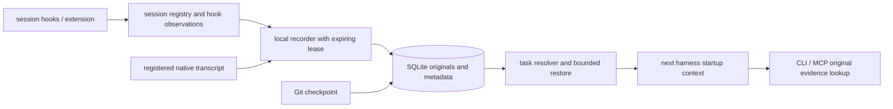

# automatic handoff implementation plan

## objective

After one project-local setup, opening a supported harness in the same worktree restores the active task without an export or handoff prompt.
`restore --task X` remains an explicit override when several tasks are possible.
The baseline is committed as `8cf6d29`.
No implementation can promise every possible harness failure; unsupported and incomplete states must be visible and recoverable.

## architecture

1. keep the Rust core, SQLite and existing import/evidence contracts.
2. add schema-v4 project opt-in, session bindings, capture health and recorder leases.
3. bind projects to canonical worktree roots; never merge sibling clones or worktrees by remote URL alone.
4. persist native harness/session identity separately from task identity.
5. install only project-local adapters and preserve unrelated configuration and instructions.
6. run capture reconciliation outside normal model calls, with a recoverable local worker and bounded hook output.
7. inject restored context at startup/compaction; keep the explicit CLI/MCP restore path available.

## states and ownership

Projects are enabled or paused.
Sessions are bound, awaiting task selection, excluded, or ended; capture health separately records current, pending, missing, or error.
Native session bindings are stable; an explicit task selection can bind an unassigned session but must not silently retarget an assigned one.
A changed branch must not move an existing session's observations into another branch automatically.
The project/worktree and observed branch are reported during restore.
An explicit override is required when multiple task candidates exist.
No model is used to guess task identity.

SQLite transactions own registry mutations; existing file imports remain atomic and idempotent.
The recorder lease expires after a crash and may be reclaimed; an older owner must stop when its token no longer matches.
Startup/restore reconciles registered sources and restarts recording, so a missing shutdown event is recoverable.
The recorder never scans personal history directories.
It reads only native transcript paths registered by an enabled project's adapter, with approved-root and same-descriptor session/project identity checks.

## capture and privacy

Raw native records remain immutable and source-linked.
Hook observations are labeled separately from complete transcripts; a missing transcript means limited coverage.
Identical hook payloads may be deduplicated as observations; transcript records retain their own source-line identities.
The existing strict consumed-prefix check detects rewrites rather than silently mixing versions.
Partial final records wait for completion; invalid complete records produce a visible error.
Unchanged files do not need repeated parsing or prefix verification.
Background reconciliation can still cost linear time in changed transcript size; this release does not claim constant-time strict verification.

Pause prevents new capture and excludes current sessions and new sessions observed during pause from later automatic backfill.
Resume applies to new sessions; start a fresh harness session to resume recording after a private interval.
An excluded session never becomes an automatic continuation candidate.
Previously recorded history is retained; controls must not imply that pausing deletes it.
Source files, credentials, repository instructions and Git working files are never modified by capture.

## restoration

Resolve exact worktree, explicit task if supplied, existing native session binding, or an unambiguous eligible task.
Do not select the newest task merely because it is newest.
If the project has no tasks, create a deterministic initial task for that worktree/branch.
If selection is ambiguous, return candidate IDs and a precise restore command without mixing their records.
Return compact current state and recent/query-relevant originals, source IDs, capture freshness, omissions, and observed Git state.
Use an application-byte cap; no tokenizer-independent token guarantee.
Retrieved history remains untrusted reference material and cannot override current user or repository instructions.
Hooks never approve permissions, block tools, or initiate model turns.

## adapters

Claude Code and Codex use native lifecycle command hooks and startup additional context.
Pi uses a thin extension over session and agent lifecycle events.
Cursor support depends on its documented hook payloads and context injection surface; no claim of equivalence without verification.
Adapters use an absolute SQnic executable/database path and correct shell quoting.
Setup is idempotent, detects conflicting ownership, and supports removal of its own adapter entries only.
Codex hook trust remains a user-controlled one-time step; setup must not disable it.

## verification gates

- migration from v3 and continued legacy commands.
- exact project/worktree isolation and nested cwd handling.
- zero/one/multiple tasks, stable session assignment and explicit selection.
- concurrent hooks, duplicate observations and crash/lease recovery.
- delayed transcript writes, partial JSONL, malformed input, missing/rewritten/replaced files.
- paused/excluded sessions and no accidental backfill.
- context byte caps, raw provenance and injected-instruction labeling.
- existing settings, repeated setup, uninstall, paths with quotes/spaces and incompatible configuration.
- synthetic real-process hook flows, plus live Claude Code/Codex startup restoration without a tool-specific user prompt.
- abrupt-exit reconciliation and measurements separating hook overhead, recorder time and model time.
- independent review before completion.

## progress

- baseline: 37 tests, formatting and Clippy passed; current work committed.
- implementation: project-local Claude/Codex hooks, Pi extension, stable bindings, native recording, bounded restore and MCP restore are implemented.
- recovery: OS lock serializes every reconciliation entry point; the process lease is only a worker-launch optimization.
- privacy: paused-session tombstones prevent later backfill; adapter removal disables capture before touching configuration.
- identity: canonical approved roots and same-descriptor native header validation precede automatic import.
- scale: each pass checks at most 256 registered files, oldest checked first; foreground whole-file input is capped at 8 MiB.
- Git: compare current HEAD, branch and status for up to 64 tasks with hooks in the previous two minutes on background passes; create checkpoints only when state differs and report stale coverage during restore.
- verification: see [the current report](automatic-verification.md) for exact checks, live harness outcomes and measured limits.

## primary integration references

- [Codex hooks](https://learn.chatgpt.com/docs/hooks)
- [Claude Code hooks](https://code.claude.com/docs/en/hooks)
- [Pi extensions](https://pi.dev/docs/latest/extensions)

## explicit limits

A native hook must actually run before SQnic can discover that conversation.
Unsupported harnesses, disabled hooks, inaccessible or encrypted history, and provider-hidden state cannot be recovered automatically.
There is no guarantee that a model will use all context correctly, even when the adapter injects it successfully.
A bounded brief can omit detail; source pointers and omission/freshness indicators are part of the contract.
Automatic Git snapshots represent observed Git state, not proof that the associated model performed the changes.
No automatic lesson application, `AGENTS.md` rewriting, remote sync or raw-history deletion is included in this feature.

## follow-up implementation

The [two-harness project trial](two-harness-project-verification.md) added sandbox-safe read-only retrieval, request-only search, Cursor hook observations, local storage controls, and release preparation.
Available source history remains authoritative evidence; agent-generated summaries and tests can be wrong.
Cursor native transcript imports remain explicit, and live Cursor model delivery remains unverified for the installed account.
